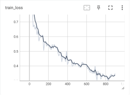
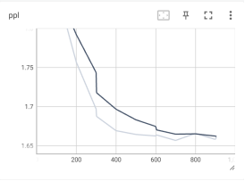

本项目为书籍《大型语言模型实战指南：应用实践与场景落地》中第7章《大型语言模型的对话要素抽取应用》实战部分代码-基于Qwen的对话要素抽取模型微调。

## 项目简介

通过Qwen-1.8B模型在医疗对话数据集中，抽取药品名称、药物类别、医疗检查、医疗操作、现病史、辅助检查、诊断结果和医疗建议等相关内容，并对Qwen-1.8B模型进行模型训练及测试，让读者更加深度地了解大型语言模型在真实场景中如何进行微调。

项目主要结构如下：
- data：存放数据的文件夹
  - all.json
- qwen1_8：Qwen-1.8B模型相关文件夹
  - modeling_qwen.py
  - tokenization_qwen.py
  - configuration_qwen.py
  - qwen_generation_utils.py
- data_helper.py：数据处理文件
- train.py：模型训练文件
- predict.py：模型预测文件
- merge_params.py：模型参数合并文件
- utils.py：模型工具文件，包括模型数据类、参数打印函数、模型保存函数、模型验证函数、线性层查找函数等

## 数据处理

数据预处理需要运行data_helper.py文件，会在data文件夹中生成训练集和测试集文件。

命令如下：

```shell
python3 data_helper.py
```

注意：如果需要修改数据生成路径或名称，请修改data_helper.py文件60-63行，自行定义。


## GPT3.5 与 Qwen-1.8B模型测试
GPT3.5测试：
```shell
python3 test_openai.py
```
需要自行设置OPENAI_API_KEY

Qwen-1.8B测试：
```shell
python3 test_qwen.py
```
需要提前下载Qwen-1_8-chat模型，[HF路径](https://huggingface.co/Qwen/Qwen-1_8B-Chat) 或 [HF-Mirror路径](https://hf-mirror.com/Qwen/Qwen-1_8B-Chat)

## 模型微调

模型训练需要运行train.py文件，会自动生成output_dir文件夹，存放每个save_model_step保存的模型文件。

命令如下：
- 单机单卡训练
```shell
CUDA_VISIBLE_DEVICES=0 deepspeed --master_port 5545 train.py --train_path data/train.json  \
                                                             --test_path data/test.json  \
                                                             --model_name_or_path Qwen-1_8-chat/  \
                                                             --per_device_train_batch_size 2  \
                                                             --max_len 2048  \
                                                             --max_src_len 1560  \
                                                             --learning_rate 1e-4  \
                                                             --weight_decay 0.1  \
                                                             --num_train_epochs 3  \
                                                             --gradient_accumulation_steps 4  \
                                                             --warmup_ratio 0.03  \
                                                             --seed 1234  \
                                                             --show_loss_step 10  \
                                                             --lora_dim 16  \
                                                             --lora_alpha 64  \
                                                             --save_model_step 100  \
                                                             --lora_dropout 0.1  \
                                                             --output_dir ./output_dir_qlora  \
                                                             --gradient_checkpointing  \
                                                             --ds_file ds_zero2_no_offload.json  \
                                                             --is_skip
```
- 单机四卡训练
```shell
CUDA_VISIBLE_DEVICES=0,1,2,3 deepspeed --master_port 5545 train.py --train_path data/train.json  \
                                                                   --test_path data/test.json  \
                                                                   --model_name_or_path Qwen-1_8-chat/  \
                                                                   --per_device_train_batch_size 2  \
                                                                   --max_len 2048  \
                                                                   --max_src_len 1560  \
                                                                   --learning_rate 1e-4  \
                                                                   --weight_decay 0.1  \
                                                                   --num_train_epochs 3  \
                                                                   --gradient_accumulation_steps 4  \
                                                                   --warmup_ratio 0.03  \
                                                                   --seed 1234  \
                                                                   --show_loss_step 10  \
                                                                   --lora_dim 16  \
                                                                   --lora_alpha 64  \
                                                                   --save_model_step 100  \
                                                                   --lora_dropout 0.1  \
                                                                   --output_dir ./output_dir_qlora  \
                                                                   --gradient_checkpointing  \
                                                                   --ds_file ds_zero2_no_offload.json  \
                                                                   --is_skip
```
注意：当服务器资源不同或读者更换数据等时，可以在模型训练时修改响应参数，详细参数说明见代码或阅读书7.3.3小节。

模型训练损失值变化示例如下：



模型测试集PPL变化示例如下：



## 模型推理

模型融合执行命令：
```shell
python3 merge_params.py --ori_model_dir "Qwen-1_8-chat/" --model_dir "output_dir_qlora/epoch-3-step-906" --save_model_dir "output_dir_qlora/epoch-3-step-906-merge"
```

推理命令如下：

```shell
python3 predict.py --device 0 --model_path "output_dir_qlora/epoch-3-step-906-merge" --max_tgt_len 512 --top_p 0.8  --temperature 0.8 --repetition_penalty 1.1
```

注意：如果修改模型路径，请修改--model_path参数。

## 总结

本项目中的代码包含大量的注释信息，帮助读者更容易的阅读代码、以及了解其原理。读者跑通代码的后，可以根据自己特定的任务，定向修改配置参数或代码，实现自己响应的功能。