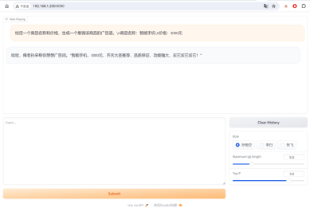

本项目为书籍《大型语言模型实战指南：应用实践与场景落地》中第6章《大型语言模型的角色扮演应用》实战部分代码-基于Baichuan的角色扮演模型微调实战。

## 项目简介

利用Baichuan2-7B模型从角色扮演对话数据集中学习角色的身份、观点、经历、成就、社交关系、语言特征等知识内容，从而提高Baichuan2-7B模型在角色扮演场景的效果，同时让读者更加深度地了解大型语言模型在角色扮演场景中如何进行微调。

项目主要结构如下：

- data：存放数据的文件夹
    - rolebench-zh_role_specific_train.jsonl
    - rolebench-zh_general_train.jsonl
    - rolebench-zh_role_specific_test.jsonl
    - rolebench-zh_general_test.jsonl
- baichuan：Baichuan2-7B模型相关文件夹。
    - modeling_baichuan.py
    - tokenization_baichuan.py
    - configuration_baichuan.py
    - generation_utils.py
- data_helper.py：数据处理文件
- train.py：模型训练文件
- web_demo.py：模型推理web页面文件
- merge_params.py：模型参数合并文件
- utils.py：模型工具文件，包括模型数据类、参数打印函数、模型保存函数、模型验证函数、线性层查找函数等


## 数据处理

数据预处理需要运行data_helper.py文件，会在data文件夹中生成训练集和测试集文件。

命令如下：

```shell
python3 data_helper.py
```

注意：如果需要修改数据生成路径或名称，请修改data_helper.py文件78-83行，自行定义。

## 模型微调

模型训练需要运行train.py文件，会自动生成output_dir文件夹，存放每个save_model_step保存的模型文件。

命令如下：

```shell
CUDA_VISIBLE_DEVICES=0 --master_port 5545  train.py --train_path data/train.json \
                                                    --test_path data/test.json  \
                                                    --model_name_or_path Baichuan2-7B-Chat/  \
                                                    --per_device_train_batch_size 2  \
                                                    --max_len 512  \
                                                    --max_src_len 256  \
                                                    --learning_rate 1e-4  \
                                                    --weight_decay 0.1  \
                                                    --num_train_epochs 1  \
                                                    --gradient_accumulation_steps 4  \
                                                    --warmup_ratio 0.03  \
                                                    --seed 1234  \
                                                    --show_loss_step 10  \
                                                    --lora_dim 16  \
                                                    --lora_alpha 64  \
                                                    --save_model_step 300 \
                                                    --lora_dropout 0.1  \
                                                    --output_dir ./output_dir  \
                                                    --gradient_checkpointing  \
                                                    --ds_file ds_zero2_no_offload.json  \
                                                    --is_skip
```

注意：当服务器资源不同或读者更换数据等时，可以在模型训练时修改响应参数，详细参数说明见代码或阅读书6.3.3小节。

Baichuan2-7B-Chat模型需要去 [HF](https://huggingface.co/baichuan-inc/Baichuan2-7B-Chat) 或 [HF-Mirror](https://hf-mirror.com/baichuan-inc/Baichuan2-7B-Chat) 下载

模型训练损失值变化示例如下：


## 模型推理
通过Web端进行角色扮演推理测试，加载训练后的模型，针对“孙悟空”角色进行对话。

模型融合执行命令：
```shell
python3 merge_params.py --ori_model_dir "Baichuan2-7B-Chat/" --model_dir "output_dir/epoch-1-step-1002" --save_model_dir "output_dir/epoch-1-step-1002-merge"
```

加web页面命令如下：

```shell
python3 web_demo.py --device 0 --model_path "output_dir/epoch-1-step-1002-merge" --desc_path "data/profiles-zh_desc.json"
```

注意：如果修改模型路径，请修改--model_path参数。

模型推理示例如下：



## 总结

本项目中的代码包含大量的注释信息，帮助读者更容易的阅读代码、以及了解其原理。读者跑通代码的后，可以根据自己特定的任务，定向修改配置参数或代码，实现自己响应的功能。